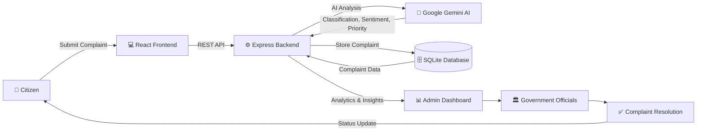
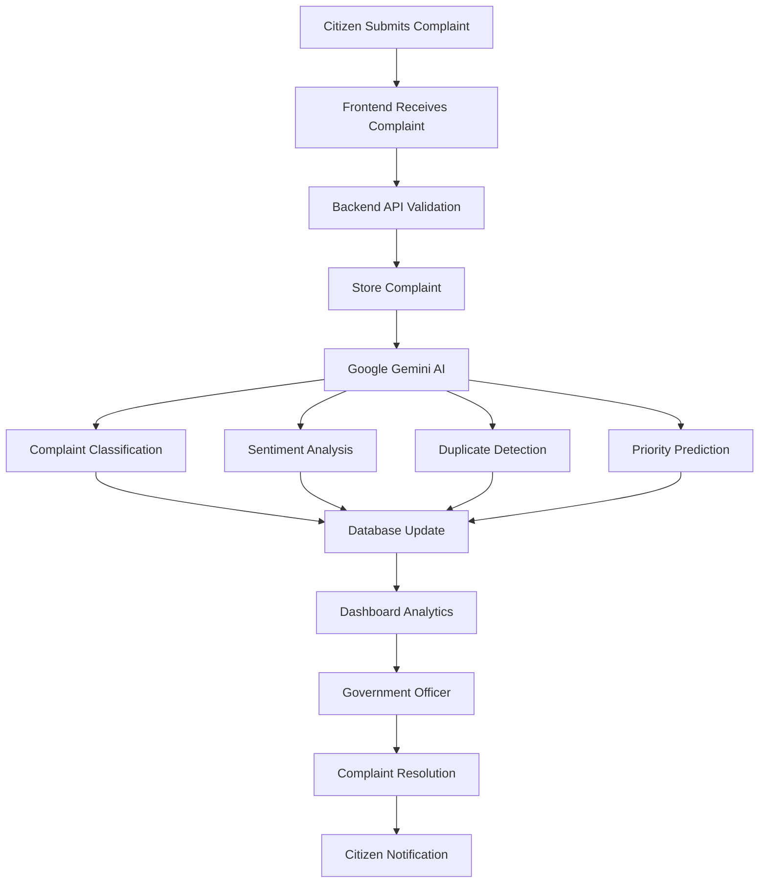
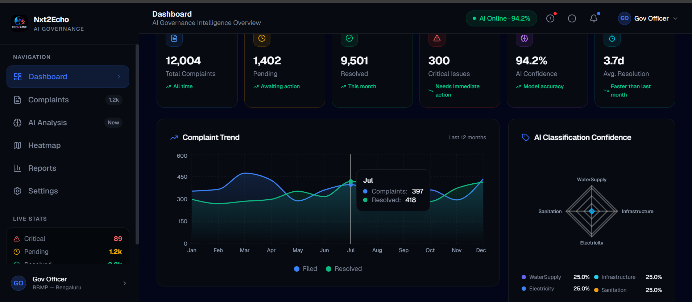
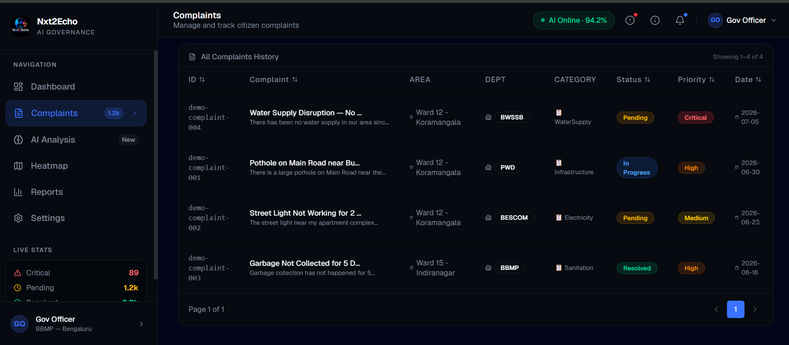
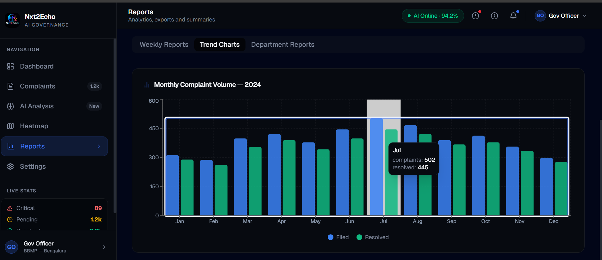
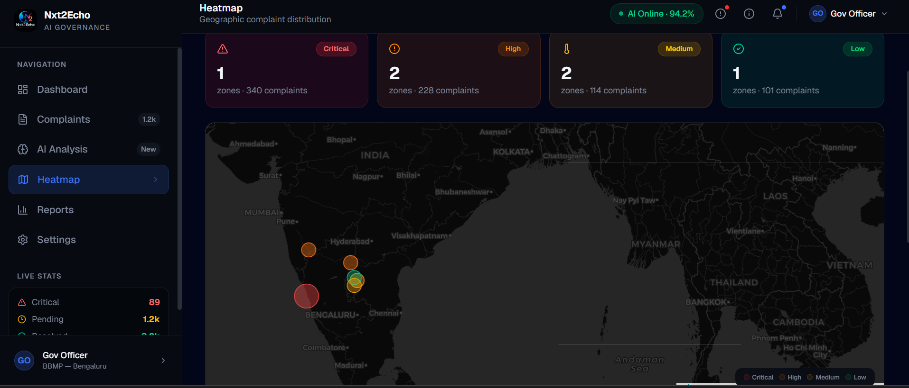
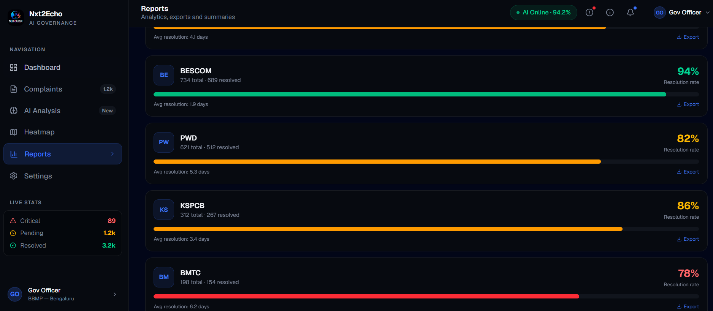
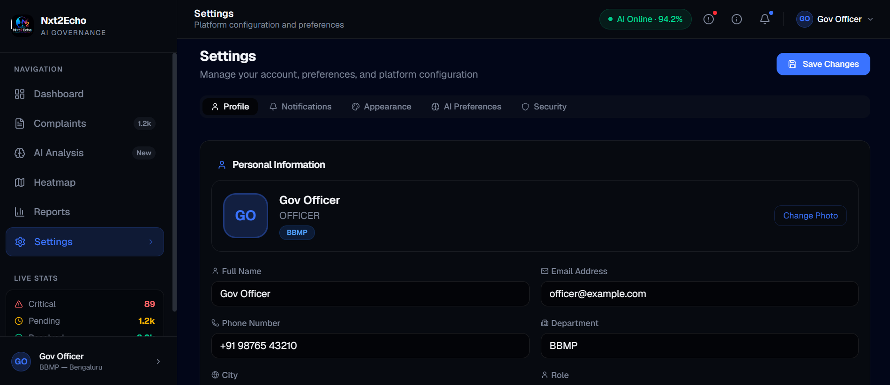
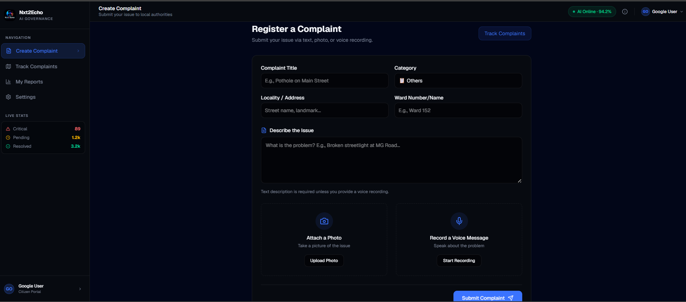
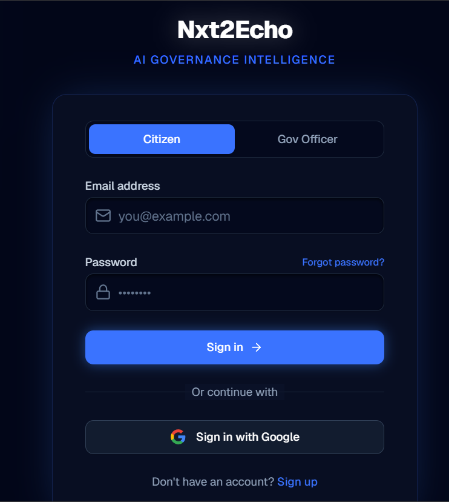

<h1 align="center">
Nxt2Echo
</h1>

<p align="center">
  
</p>

<h2 align="center">
Transforming Citizen Voices into
Actionable Governance Intelligence.
</h2>

<div align="center">


<br><br>


<br>


<br>


<br>


</div>

---

# 📖 Overview

Nxt2Echo is an AI-powered Governance Intelligence Platform designed to modernize the way governments receive, analyze, and resolve citizen grievances.

Traditional complaint management systems often struggle with large complaint volumes, duplicate submissions, manual categorization, delayed responses, and limited analytical capabilities. These challenges reduce operational efficiency and make it difficult for authorities to identify critical issues in time.

Nxt2Echo addresses these challenges by combining modern web technologies with Artificial Intelligence to transform raw citizen complaints into structured, actionable governance insights.

The platform automatically classifies complaints, detects duplicate reports, analyzes sentiment, prioritizes urgent cases, and provides interactive dashboards, analytics, heatmaps, and AI-generated insights for decision-makers.

Instead of functioning as just another complaint portal, Nxt2Echo serves as an intelligent decision-support system that enables government authorities to respond faster, allocate resources efficiently, and make data-driven policy decisions.

Built with scalability, modularity, and real-world usability in mind, the platform demonstrates how Artificial Intelligence can significantly improve transparency, responsiveness, and public service delivery.

---

# 🎯 Problem Statement

Government departments receive thousands of citizen complaints every day through multiple channels. Managing these complaints manually presents several operational challenges:

- Large volumes of complaints become difficult to organize and prioritize.
- Duplicate complaints consume valuable administrative time.
- Manual categorization delays routing complaints to the correct departments.
- Authorities lack real-time analytics to identify emerging issues.
- Decision-makers have limited visibility into complaint trends and regional problem hotspots.
- Citizens often experience slow responses due to inefficient workflows.

These challenges reduce governance efficiency and affect citizen satisfaction.

---

# 💡 Our Solution

Nxt2Echo introduces an AI-driven governance platform that automates complaint analysis and assists authorities throughout the grievance management lifecycle.

The platform provides:

- 🤖 AI-powered complaint classification
- 🧠 Intelligent duplicate complaint detection
- 😊 Sentiment analysis for urgency identification
- 🚨 Smart priority prediction
- 📊 Interactive governance dashboards
- 🗺️ Geographic complaint heatmaps
- 📈 Advanced analytics and reporting
- ⚡ API-driven architecture for seamless integration
- 📑 Data-backed decision support for government officials

By integrating Artificial Intelligence directly into complaint management workflows, Nxt2Echo enables governments to resolve issues more efficiently while improving transparency and citizen trust.

---

# ✨ Key Features

## 📝 Smart Complaint Management

- Register and manage citizen complaints through an intuitive interface.
- Track complaint status from submission to resolution.
- Advanced search, filtering, and categorization for efficient complaint handling.

---

## 🤖 AI-Powered Complaint Analysis

- Automatically categorizes complaints using Google Gemini AI.
- Detects complaint intent and extracts meaningful information.
- Generates intelligent summaries for faster decision-making.

---

## 😊 Sentiment & Priority Detection

- Analyzes complaint sentiment to identify frustrated or urgent citizens.
- Predicts complaint priority based on severity and context.
- Helps departments respond to critical issues first.

---

## 🔄 Duplicate Complaint Detection

- Identifies complaints describing the same issue.
- Reduces redundant records.
- Saves administrative effort and improves workflow efficiency.

---

## 📊 Interactive Dashboard

- Real-time statistics and key performance indicators (KPIs).
- Complaint trends and department-wise analytics.
- Quick overview of overall governance performance.

---

## 📈 Analytics & Insights

- AI-generated insights for authorities.
- Complaint trend analysis.
- Category-wise and department-wise performance visualization.

---

## 🗺️ Geographic Heatmaps

- Visualizes complaint density across different regions.
- Helps identify high-impact problem areas.
- Enables better resource allocation and planning.

---

## 📑 Reports & Data Export

- Generate structured reports for decision-makers.
- Export complaint data for further analysis.
- Simplifies governance reporting and documentation.

---

## 🔐 Secure Authentication

- JWT-based authentication for secure access.
- Protected API endpoints.
- Role-based access architecture for future scalability.

---

## ⚡ API-Driven Architecture

- Fully modular REST API architecture.
- Frontend and backend communicate through reusable APIs.
- Designed for future cloud deployment and mobile applications.

---

## 📱 Modern Responsive UI

- Built using React, Vite, Tailwind CSS, and ShadCN UI.
- Responsive design for desktops and tablets.
- Clean dashboard optimized for government officials.

---

## 🚀 Scalable System Design

- Modular folder structure.
- Easily extendable AI modules.
- Ready for integration with cloud infrastructure and additional government services.

  ---

# 🤖 AI Capabilities

Artificial Intelligence is the core of Nxt2Echo. Instead of acting as a traditional complaint management system, the platform leverages Google Gemini AI to assist government authorities in understanding citizen grievances faster and making informed decisions.

### 🧠 Intelligent Complaint Classification

Automatically categorizes complaints into the most relevant government department based on the complaint description, reducing manual effort and improving routing accuracy.

---

### 😊 Sentiment Analysis

Analyzes the emotional tone of complaints to identify frustrated, urgent, or high-impact issues that require immediate attention.

---

### 🔄 Duplicate Complaint Detection

Identifies complaints describing the same issue and groups them together to avoid duplicate records, reducing administrative workload.

---

### 🚨 Smart Priority Prediction

Evaluates complaint severity and urgency to classify issues into priority levels such as Critical, High, Medium, and Low.

---

### 📄 AI-Generated Summaries

Generates concise summaries for lengthy complaints, allowing officials to quickly understand the issue without reading the complete text.

---

### 📊 Governance Insights

Provides AI-driven observations and recommendations by analyzing complaint trends, recurring issues, and departmental performance to support data-driven decision-making.

---

### 🌍 Future AI Enhancements

The platform is designed to support future AI capabilities including:

- Multilingual complaint understanding
- Voice-to-text complaint processing
- Predictive governance analytics
- Image-based issue detection
- Recommendation engine for government departments
- AI-powered citizen assistance chatbot

  ---

# 🏗️ System Architecture

The platform follows a modular architecture where the frontend communicates with a secure backend, which processes requests, interacts with the AI engine, stores data in the database, and delivers actionable insights through an administrative dashboard.



---

# 🔄 Complaint Processing Workflow

The following workflow illustrates how a complaint travels through the system—from submission to final resolution.



---

# 📸 Application Preview

The platform consists of multiple modules that work together to provide a complete AI-powered governance solution.

| Dashboard | Complaints |
|-----------|------------|
|  |  |

| Analytics | Heatmap |
|-----------|----------|
|  |  |

| Reports | Settings |
|----------|----------|
|  |  |

| User Complaints | Login Interface |
|----------|----------|
|  |  |

---

# 🛠️ Technology Stack

| Category | Technologies |
|-----------|--------------|
|  Frontend | React.js, Vite, Tailwind CSS, ShadCN UI, React Router DOM |
|  Backend | Node.js, Express.js, TypeScript |
|  Artificial Intelligence | Google Gemini API |
|  Database | SQLite |
|  Authentication | JWT, Firebase Authentication |
|  API Documentation | Swagger (OpenAPI) |
|  API Testing | Postman |
|  Development Tools | VS Code, Git, GitHub |
|  Deployment | Vercel (Frontend & Backend Ready) |

---

# 🚀 Getting Started

Follow the steps below to run the project locally.

## 1️⃣ Clone Repository

```bash
git clone https://github.com/Nxt2Echo/Nxt2Echo---AI--Governance.git

cd Nxt2Echo---AI--Governance
```

---

## 2️⃣ Install Frontend Dependencies

```bash
cd frontend

npm install
```

---

## 3️⃣ Install Backend Dependencies

```bash
cd backend

npm install
```

---

## 4️⃣ Configure Environment Variables

Create a `.env` file inside the backend directory.

Example:

```env
PORT=5000

JWT_SECRET=your_secret_key

DATABASE_URL=database.sqlite

GEMINI_API_KEY=your_google_gemini_api_key
```

---

## 5️⃣ Start Backend

```bash
cd backend

npm run dev
```

Backend runs at:

```
http://localhost:5000
```

---

## 6️⃣ Start Frontend

```bash
cd frontend

npm run dev
```

Frontend runs at:

```
http://localhost:5173
```

---

# ⚙️ Environment Variables

| Variable | Description |
|----------|-------------|
| PORT | Backend server port |
| JWT_SECRET | Secret key for JWT Authentication |
| DATABASE_URL | SQLite database path |
| GEMINI_API_KEY | Google Gemini API Key |
| FIREBASE_PROJECT_ID | Firebase Project ID |
| FIREBASE_CLIENT_EMAIL | Firebase Admin Client Email |
| FIREBASE_PRIVATE_KEY | Firebase Admin Private Key |
| VITE_FIREBASE_API_KEY | Frontend Firebase API Key |
| VITE_FIREBASE_AUTH_DOMAIN | Firebase Authentication Domain |
| VITE_FIREBASE_STORAGE_BUCKET | Firebase Storage Bucket |
| VITE_FIREBASE_MESSAGING_SENDER_ID | Firebase Messaging Sender ID |
| VITE_FIREBASE_APP_ID | Firebase Application ID |

---

# 📡 REST API Overview

The backend exposes a secure RESTful API that powers all frontend operations. APIs are organized into dedicated modules for authentication, complaint management, analytics, reporting, AI services, and system health monitoring.

## Authentication

| Method | Endpoint | Description |
|--------|----------|-------------|
| POST | `/api/auth/register` | Register a new user |
| POST | `/api/auth/login` | User authentication |
| POST | `/api/auth/send-otp` | Send OTP |
| POST | `/api/auth/verify-otp` | Verify OTP |
| POST | `/api/auth/forgot-password` | Forgot Password |
| POST | `/api/auth/reset-password` | Reset Password |

---

## Complaints

| Method | Endpoint |
|--------|----------|
| GET | `/api/complaints` |
| GET | `/api/complaints/:id` |
| POST | `/api/complaints` |
| PUT | `/api/complaints/:id` |
| DELETE | `/api/complaints/:id` |

---

## Analytics

| Method | Endpoint |
|--------|----------|
| GET | `/api/analytics/complaint-trend` |
| GET | `/api/analytics/categories` |
| GET | `/api/analytics/departments` |
| GET | `/api/analytics/sentiment` |

---

## AI

| Method | Endpoint |
|--------|----------|
| GET | `/api/ai/insights` |
| POST | `/api/gemini/chat` |

---

## Reports

| Method | Endpoint |
|--------|----------|
| GET | `/api/reports` |
| GET | `/api/reports/stats/weekly` |

---

## Health

| Method | Endpoint |
|--------|----------|
| GET | `/api/health` |

---

# 📖 API Documentation

Interactive API documentation is available through **Swagger UI**.

```
http://localhost:5000/api-docs
```

Swagger provides:

- Interactive API testing
- Request & Response examples
- Authentication support
- Endpoint documentation

  ---

# 🔒 Security

Security has been considered throughout the application architecture.

- JWT Authentication
- Protected API Routes
- Role-Based Access Control
- Secure Password Handling
- Environment Variable Protection
- API Authorization
- Input Validation
- HTTPS Ready Architecture

  ---

# 🚀 Deployment

The application is designed for cloud deployment.

### Frontend

- Vercel
- Netlify

### Backend

- Render
- Railway
- Vercel Functions
- Node.js Server

Before deployment ensure:

- Environment Variables are configured
- API URLs are updated
- Gemini API Key is available
- Database configuration is correct

  ---

# 🛣️ Future Roadmap

The platform is designed to evolve beyond the hackathon prototype.

### Planned Enhancements

- 🌍 Multilingual Complaint Processing
- 🎤 Voice-Based Complaint Submission
- 📷 Image-Based Issue Detection
- 🤖 AI Chat Assistant
- 📱 Android & iOS Mobile Application
- 🔔 WhatsApp & SMS Notifications
- 📊 Predictive Governance Analytics
- ☁️ Cloud-Native Deployment
- 🌐 GIS-Based Advanced Heatmaps
- 📈 Performance Monitoring Dashboard

  ---

---

# 👥 Meet the Team

<table>
<tr>

<td align="center">
<a href="https://github.com/Mrunal-dev05">
<br>
<b>Mrunal Pimpale</b>
</a>
</td>

<td align="center">
<a href="https://github.com/ssoham242-ruler">
<br>
<b>Soham Sonawane</b>
</a>
</td>

<td align="center">
<a href="https://github.com/Alpha5635">
<br>
<b>Kaushal Thakare</b>
</a>
</td>

<td align="center">
<a href="https://github.com/Sharan-iodev">
<br>
<b>Sharan Gounder</b>
</a>
</td>
</table>

---

# 📜 License

This project is licensed under the **MIT License**.

See the LICENSE file for more details.

---

<div align="center">

## ⭐ If you found this project useful, consider giving it a Star!

Thank you for visiting the Nxt2Echo repository.

Built using **React**, **Node.js**, **Google Gemini AI**, and **Modern Web Technologies**.

© 2026 Team Nxt2Echo • Google Hackathon Project

</div>


